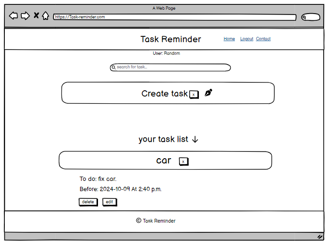

# Task Reminder
This is Task Reminder. It's designed to help users keeping track of importent things that need to get done.
user can create tasks, mark tasks as compleded, edit the tasks and delete tasks. You need to have an account to use the Task Reminder.
So user must create account by register and then have full access to the application.
This is a Full Stack project build with the django framework.

## Task Reminder - Table Content

* [Planning and Design](#planning-and-design)
* [Agile methodology](#agile-methodology)
* [Wireframes](#wireframes )
* [Features](#features )
* [More Features](#more-features )
* [Libraries](#libraries )
* [Technical Stack](#technical-stack )

## Planning and Design

### User storys

#### Admin 
As a **Site Admin** I can **read, delete, update, and create tasks** so that **admin can fix problems**

* Be able to change the task, delete task, update task, create task.

#### Update or delete task 

As a **Site user** I can **Modify and delete tasks** so that **user can modify it as wanted**

* User can update the task.

* User can delete tasks.

#### Registration for using Task Reminder

As a **Site User** I can **Start using the Task Reminder** so that **can save the tasks in the list**

- User can register there own account.

- If user is logged in can use the task reminder to add task.

- Own site for log in.

#### Adding task

As a **Site User** I can **Add tasks to the task list** so that **Be able to remember the task needed to be done**

- User can add task.

- User get a response message when add task

## Agile methodology

Used an agile working method while working on this project. which worked, but first time apply this method on a project.
Its a good method to use to control that all of the things that need to be in the project actually is done.
You get to know where in the project you are.

#### 3 steps when using.

#### To Do
When the user story is created.
#### In Progress
When the user story is in progress to get done.
#### Done
When the user story is done.

Project Here

 

#### User story information 

User story information

 

* With all the acceptance criterias that are needed.

### Diagram Models

Diagram models with 

 

* created with lucid.app

## Wireframes 

### display for mobile.

Homepage

 

- index.html

Sign in page 

 

- sign in

Account registration 

 

- Registration 

Contact page 

 

- contact 

tasks 

 

- task page 

Task open 

 

- task page open

Add a task 

 

- add tasks

### Display for desktop

Homepage

 

- index.html

Sign in page 

 

- sign in 

Sign up page

 

- sign up

Contact page

 

- contact

Add task page

 

- add task

Edit task page

 

- edit 

Delete page 

 

- delete

Open task page

 

- open task

Sign out page

 

- Sign out

## Features

### Navigationbar 

Navigation bar desktop

 

Navigation bar mobil

 

* Dropdown link to all pages if under 400px.(with icon from font awesome.)
* The navbar contains links to contact and sign up, login, and to the homepage.
* And changes if user is sign in to the website.(logout,contact, and home).
* responsive.

### Homepage

Homepage desktop

 

Homepage mobil

 

* Homepage shows user to register account to get access to the test reminder.
* show links to login
* shows link to register
* Responsive

### Tasks 

tasks desktop

 

tasks mobil

 

* Shows User where to add tasks.
* User can open there own tasks on the open button.
* Shows clear text where your new tasks are made.
* Responsive site.

### Edit tasks

Tasks edit desktop

 

Tasks edit mobil

 

* User can add title,description and even time and date for tasks.

### Edit the made tasks

Tasks edit old task desktop

 

Tasks edit old task mobil

 

* Here user can Edit old tasks.
* user can choose the completed option in this edit here

### Delete page 

Delete page desktop

 

Delete page mobil

 

* User can choose to delete the task.
* User can choose to go back to the tasks.

### Sign out page 

sign out desktop

 

sign out mobil

 

* User can choose the option to sign out 
* User can go back to tasks.

### Sign in page

sign in desktop

 

sign in mobil

 

* User can choose the option to sign in. 
* User can go back to register.

### View task in list

view task desktop

 

view task mobil

 

* Here user can see the task that needs to be done
* Date and time.
* and options to delete or edit.

### Contact

Contact desktop

 

Contact mobil

 

* User can send a contect for to Task reminder.

### Sign up for account

Register desktop

 

Register mobil

 

* User can create account for using the task reminder.
* or have the option to login if account already made.

### Searchbar

seachbar desktop

 

seachbar mobil

 

* User can search for task that exist in the list.
* error if no task exist of that name.
* need to fill in something in the search input.

### Footer

Footer desktop

 

Footer mobil

 

* Footer contains copyright Task Remember

## More Features

* want to creat tasklist with categorys.
* when completed task goes into a done category.

## Libraries

* asgiref: Helps Django handle tasks in the background.
* dj-database-url: Makes it easier to set up the database.
* Django: The framework used to build the website.
* gunicorn: Runs the website on a server.
* psycopg2: Connects the website to a PostgreSQL database.
* sqlparse: Helps organize and format database queries.
* whitenoise: Helps the website with static files.

## Technical Stack
These are the things used for this project.

* Django - was used as framwork
* HTML -  Was used for front-end.
* CSS - Was used to style the site.
* Bootstrap - Used to style the website.
* Python - Made to create back-end.
* Javascript - for interactivity
* Gitpod - development environment
* Git - Version control system
* PostgreSQL - Database management system
* lucidchar - Creating my models Diagram.
* Heroku - deploying web applications

## Testing

### Lighthouse

## Validation
### W3C Testing
### CSS jigsaw
### jshint Javascript
### CI Python Linter

## Testing in django 

## Bugs

### unsolved bugs

## Deployment

### creating repository on github for project

### creating heroku application

### deploy to heroku 

## Credits

## Acknowledgements

